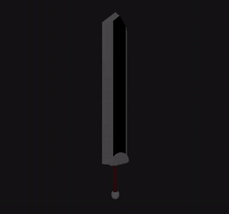
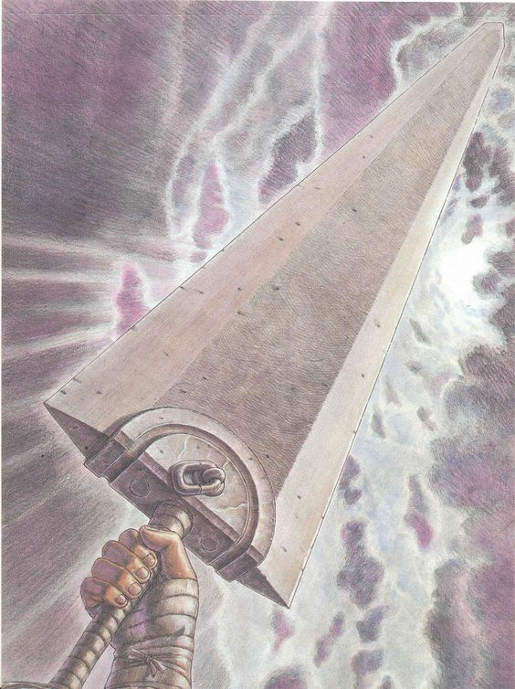

<h1 align="center">Guts' Dragonslayer ⚔️💀🩸</h1>

> "It was too big to be called a sword. Too big, too thick, too heavy, and too rough. It was more like a heap of raw iron." 
>
> — *Berserk*, Kentaro Miura

The iconic sword from the manga Berserk built with ThreeJS, a JavaScript library used to display animated 3D Computer Graphics

  

  
  
  

<h2 align="center">Getting Started</h2>
<h3>Pre-requisites</h3>

Node.js (version 20.11.1 or higher)

npm (usually comes with Node.js)

Live Server (for running the project locally)

<h3>Running the project locally</h2>

git clone https://github.com/caio2983/Guts-Greatsword.git

npm install

click on Live Server

